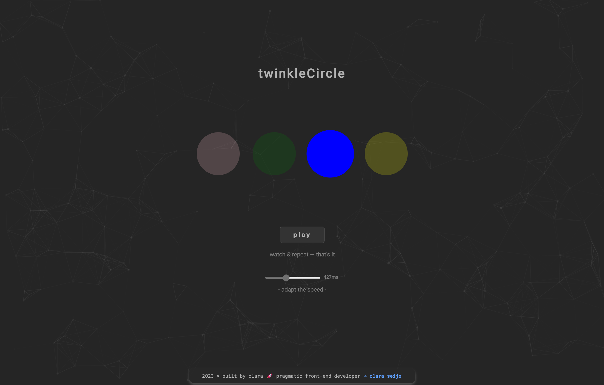

# twinkle-circle
**a modern twist on a classic to test your own random access memory**


### Have Fun → [twinkleCircle](https://clasei.github.io/twinkle-circle/)
[](./src/assets/twinkle-circle-screenshot-1.png)

---

### Releases

**» [twinkle-circle v1.0.0](https://github.com/clasei/twinkle-circle/releases/tag/v1.0.0)**

---

### How It Works
The game initializes with a random circle lighting up, signifying the start of the sequence. As players progress, the sequence grows. To play, users should replicate the sequence by clicking on the circles in the correct order.

---

### Installation

  `git clone https://github.com/clasei/twinkle-circle.git`

---

### Customization

- **Particles**: to modify, navigate to `particles.js` and adjust theparameters
- **Circles**: changes can be made in `Circle.js`
- **Slider**: changes can be made in `ControlPanel.js` 

### Getting Started with Create React App

This project was bootstrapped with [Create React App](https://github.com/facebook/create-react-app)

---

### License

Project is licensed under the Creative Commons License

**License — [particles.js](https://github.com/VincentGarreau/particles.js)**

The library `particles.js` is under the [MIT License](https://github.com/VincentGarreau/particles.js/blob/master/LICENSE.md) by [Vincent Garreau](https://github.com/VincentGarreau)

---

### Feedback, Forks & Contributions

Feel free to open an issue if you have any suggestion

Interested in contributing or customizing? Fork the project

Thoughts? Write to [**clasei@proton.me**](mailto:clasei@proton.me)

```[ build, don't talk ]```
